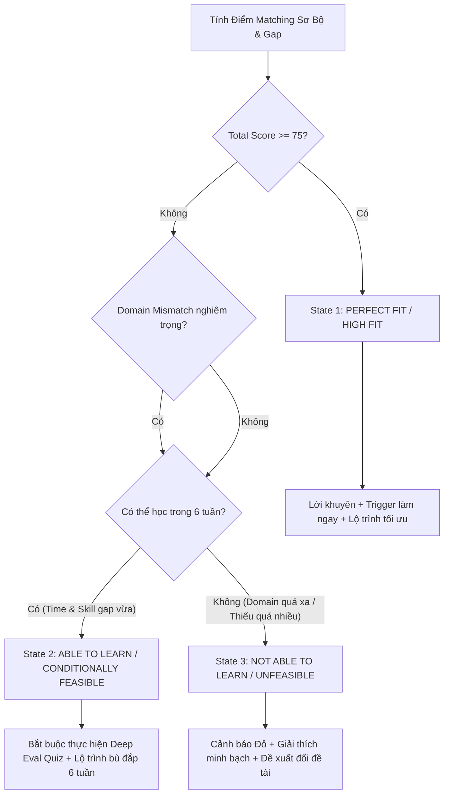

# Comprehensive Evaluation Criteria & Decision Framework (criteria.md)

Tài liệu này định nghĩa hệ thống tiêu chí đánh giá đa tiêu chí (MCDA - Multi-Criteria Decision Analysis), taxonomy phân loại kỹ năng, quy tắc phân tích ẩn (latent profiling), bộ kịch bản phân nhánh kết luận và cơ chế fallback cho hệ thống **MatchSkill AI**.

---

## 1. Bộ Tiêu Chí Đánh Giá Cốt Lõi (Evaluation Criteria Matrix)

Hệ thống đánh giá tổng thể dựa trên **4 nhóm tiêu chí độc lập** với tổng trọng số 100%:

| Mã Tiêu Chí | Tên Tiêu Chí | Trọng Số | Ý Nghĩa & Cách Tính | Thang Điểm |
|---|---|---|---|---|
| **C1** | **Skill Compatibility** (Tương thích Kỹ năng Khớp) | **35%** | Mức độ trùng khớp giữa Kỹ năng hiện có (từ Hồ sơ + Latent Analysis) và Tech Stack / Yêu cầu đầu ra của đề tài. | 0 – 100 |
| **C2** | **Domain & Problem Fit** (Độ phù hợp Khối & Lĩnh vực) | **25%** | Mức độ phù hợp giữa Lĩnh vực quan tâm (Fields of Interest), ngành học/làm việc hiện tại và Bài toán của đề tài (ví dụ: NLP vs CV vs Robotics vs Web). | 0 – 100 |
| **C3** | **Learning Curve & Adaptability** (Khả năng học & Bù đắp Gap) | **20%** | Khả năng tự học và bù đắp các skill còn thiếu trong thời gian **6 tuần** dựa trên điểm Đánh giá sâu (Deep Evaluation Quiz) và thời gian cam kết (`hours_per_week`). | 0 – 100 |
| **C4** | **Resource & Execution Risk** (Rủi ro Nguồn lực & Tiến độ) | **20%** | Đánh giá rủi ro giới hạn thành viên (`max_team`), hạ tầng (Hardware/GPU/Dataset), độ khó bài toán và rủi ro vỡ tiến độ. | 0 – 100 |

### Công thức tính Total Matching Score ($S_{total}$):
$$S_{total} = (C1 \times 0.35) + (C2 \times 0.25) + (C3 \times 0.20) + (C4 \times 0.20)$$

---

## 2. Taxonomy Phân Loại Kỹ Năng & Latent Profiling

### 2.1. Skill Mapping Matrix (Taxonomy)
Hệ thống sử dụng bảng ánh xạ kỹ năng để phân tích từ kho từ vựng thô sang các nhóm kỹ năng chuẩn hóa:

```json
{
  "frontend": ["React", "Vue", "Angular", "HTML/CSS", "JavaScript", "TypeScript", "Tailwind", "UI/UX Design"],
  "backend": ["Python", "Nodejs", "Java", "FastAPI", "Express", "Django", "SpringBoot", "PostgreSQL", "MySQL", "MongoDB", "Redis", "REST API"],
  "ai_ml_core": ["Machine Learning", "Deep Learning", "Python", "PyTorch", "TensorFlow", "Scikit-learn", "Pandas", "Statistics", "Math"],
  "nlp_llm": ["NLP", "Prompt Engineering", "RAG", "LangChain", "BERT", "GPT", "LLM", "Text Mining"],
  "computer_vision": ["Computer Vision", "OpenCV", "YOLO", "Image Processing", "CNN"],
  "robotics_iot": ["ROS", "C++", "Matlab", "IoT", "Embedded", "Hardware", "Arduino", "Raspberry Pi"],
  "devops_cloud": ["Docker", "DevOps/Cloud", "GCP", "AWS", "Azure", "Linux", "Git", "CI/CD", "Kubernetes"],
  "product_leadership": ["Product Management", "Project Management", "Business Analysis", "Team Leadership", "Agile", "User/Market Research"]
}
```

### 2.2. Latent Profiling Engine (Phân tích Ẩn từ Mô tả Bản thân)
Nhiều thành viên không ghi rõ kỹ năng dạng checklist mà ghi ở đoạn giới thiệu (`introduction`). Agent sẽ parse ẩn:
- **Từ khóa kinh nghiệm**: `"5 năm kinh nghiệm"`, `"đã từng triển khai RAG"` $\rightarrow$ Tự động boost Proficiency level từ 3 up 4/5.
- **Lĩnh vực từng làm**: `"làm chatbot hành chính"`, `"thiết bị đeo y tế"` $\rightarrow$ Trích xuất Domain Tag: `[Chính phủ số]`, `[IoT/Healthtech]`.
- **Kỹ năng ẩn**: Nếu ghi `"xây dựng ứng dụng di động"` nhưng chưa tích chọn `Mobile` $\rightarrow$ Tự động bổ sung `Mobile: Level 3`.

---

## 3. Phân Nhánh Kết Luận & Kịch Bản Đánh Giá (Decision Outcomes)

Hệ thống chia kết quả đánh giá thành **4 Trạng Thái Khả Thi Cụ Thể (Fit Outcomes)**:



### Chi Tiết Kịch Bản Đánh Giá:

| Trạng Thái (Outcome State) | Điều Kiện Kích Hoạt | Phân Tích & Giải Thích Minh Bạch | Hành Động Hướng Dẫn & Lộ Trình |
|---|---|---|---|
| **1. PERFECT / HIGH FIT** | $S_{total} \ge 75\%$, không thiếu skill nòng cốt, kinh nghiệm sẵn có. | "Nhóm đã từng làm hoặc có sẵn kiến thức nền tảng vững chắc. Rủi ro vỡ tiến độ < 10%." | Bắt tay vào làm ngay. Lộ trình tập trung tối ưu hóa tính năng nâng cao và UI/UX. |
| **2. ABLE TO LEARN (Conditionally Feasible)** | $50\% \le S_{total} < 75\%$, thiếu 1-3 skill nhưng có kiến thức nền tương quan, thời gian học $\le 2$ tuần. | "Nhóm chưa từng làm đề tài này nhưng có nền tảng tư duy phù hợp (vd: biết Python & ML cơ bản, chưa làm RAG). Đủ khả năng tự học trong 6 tuần." | Kích hoạt bộ câu hỏi Deep Evaluation Quiz. Sinh lộ trình 6 tuần: 2 tuần đầu học cấp tốc, 4 tuần sau vừa làm vừa hoàn thiện. |
| **3. NOT ABLE TO LEARN (High Risk / Unfeasible)** | $S_{total} < 50\%$ HOẶC lệch Domain nghiêm trọng (vd: chuyên Web/NLP chuyển sang Robotics/Xe tự hành), thiếu $> 3$ skill nòng cốt. | "Nhóm chưa từng học và không thể gánh lượng kiến thức mới quá lớn trong thời gian giới hạn 6 tuần. Rủi ro vỡ tiến độ > 80%." | Hiển thị Cảnh báo Đỏ. Giải thích minh bạch nguyên nhân (Domain gap / Time gap). Khuyên nhóm chuyển sang đề tài khác trong kho. |
| **4. OVER-CAPACITY / NO FIT (Nguồn lực/Max Team)** | Số lượng thành viên $> \text{Max Team}$ hoặc thời gian cam kết $< 10\text{h/tuần}$. | "Rào cản nhân sự hoặc thời gian không đáp ứng quy định đồ án." | Từ chối hoặc yêu cầu điều chỉnh quy mô nhóm. |

---

## 4. Quy Trình Hai Bước (Two-Step Assessment Flow & Cost Control)

Để tránh lãng phí chi phí API khi người dùng **Multi-select nhiều đề tài cùng lúc**, hệ thống thực hiện phân tách 2 giai đoạn:

```
[Bước 1: Fitting Sơ Bộ (Client-side MCDA)] 
   ├── Input: Profile nhóm + N đề tài được chọn trong Multi-select.
   ├── Engine: Tự động chạy thuật toán MCDA toán học thuần trên browser (0$ API cost).
   └── Output: Bảng xếp hạng Top Đề Tài kèm Điểm %, Skill Matched, Skill Gap & Tag cảnh báo.

[Bước 2: Đánh Giá Sâu On-Demand (Per-Topic Deep Assessment)]
   ├── Trigger: Người dùng bấm "View Detailed Analysis & Deep Evaluation" trên MỘT ĐỀ TÀI CỤ THỂ.
   ├── Dynamic Quiz Generator: Agent sinh bộ câu hỏi trừu tượng & chuyên sâu (3-5 câu) RIÊNG cho đề tài đó.
   ├── User Input: Học viên nhập câu trả lời / chọn thang điểm / số giờ cam kết / tự luận.
   └── Agent Evaluation Module: Gọi Gemini / GPT API phân tích câu trả lời ➔ Trả về Kết luận cuối cùng + Lộ trình 6 tuần.
```

### 4.2. Bộ Tiêu Chí Sinh Câu Hỏi Đánh Giá Sâu Linh Hoạt (Dynamic Quiz Criteria)

Mỗi đề tài khi click xem đánh giá sâu sẽ được Agent sinh ra bộ câu hỏi linh hoạt đáp ứng **4 dạng câu hỏi bắt buộc**:

1. **Câu Hỏi Hình Dung Đầu Ra (Abstract / Architectural Product Vision - Scale 1-5)**:
   - *Mục tiêu*: Đánh giá mức độ mơ hồ hay rõ ràng về sản phẩm thực tế cần nộp tại CP6.
   - *Ví dụ*: "Nhóm bạn hình dung như thế nào về kiến trúc Agent xây lộ trình học cá nhân hóa cho đề tài [EDU-06]?"

2. **Câu Hỏi Kế Hoạch Bù Đắp Kỹ Năng Thiếu (Skill Gap Mitigation Strategy - Multiple Choice)**:
   - *Mục tiêu*: Đánh giá phương pháp bù đắp cho từng skill bị thiếu cụ thể (vd: Docker, RAG, PyTorch).
   - *Ví dụ*: "Đối với kỹ năng [RAG / Vector DB] còn thiếu, nhóm sẽ phân chia học tự học hay nhờ TA?"

3. **Câu Hỏi Tự Luận Giải Pháp Kỹ Thuật Chuyên Sâu (Deep Technical Essay / Open Text)**:
   - *Mục tiêu*: Đánh giá tư duy thiết kế hệ thống thực chiến cho đề tài đang chọn.
   - *Ví dụ*: "Mô tả ngắn gọn hướng tiếp cận kỹ thuật của nhóm để xử lý bài toán Cold-Start cho người học mới trong đề tài [EDU-06]?"

4. **Câu Hỏi Cam Kết Thời Gian & Nguồn Lực (Daily Capacity & Commitment - Numeric)**:
   - *Mục tiêu*: Tính toán tổng năng suất làm việc (Hours/Week = Thành viên $\times$ Giờ/ngày $\times$ 5 ngày).

---

## 5. Danh Sách Agent Tools & Registry (Agent Function Calling)

Hệ thống đăng ký 6 Agent Tools chuẩn hóa:

```python
# 1. Input & Parsing Tool
register_tool(
    name="parse_member_profile",
    description="Parse và trích xuất kỹ năng ẩn (latent skills), số năm kinh nghiệm, lĩnh vực quan tâm từ thông tin giới thiệu bản thân.",
    parameters={"profile_text": "string", "proficiency_dict": "object"}
)

# 2. Preset Data Tool
register_tool(
    name="load_mock_profiles",
    description="Tải danh sách hồ sơ mockdata từ mork_data/mock_profiles.json để thử nghiệm.",
    parameters={"preset_id": "string"}
)

# 3. Fitting Engine Tool
register_tool(
    name="evaluate_preliminary_fit",
    description="Tính toán điểm MCDA sơ bộ cho danh sách đề tài multi-select dựa trên skill taxonomy.",
    parameters={"team_profiles": "array", "selected_topic_codes": "array"}
)

# 4. Quiz Generation Tool
register_tool(
    name="generate_topic_deep_quiz",
    description="Sinh bộ câu hỏi trừu tượng và chuyên sâu thiết kế riêng cho MỘT đề tài cụ thể dựa trên skill gap.",
    parameters={"topic_code": "string", "missing_skills": "array", "domain_gap": "boolean"}
)

# 5. Final Assessment Tool
register_tool(
    name="evaluate_deep_response",
    description="Phân tích câu trả lời đánh giá sâu, kết hợp kinh nghiệm thành viên để đưa ra kết luận (Fit/Able to Learn/Not Able to Learn) và lộ trình 6 tuần.",
    parameters={"topic_code": "string", "quiz_answers": "object", "team_capacity": "object"}
)

# 6. Fallback Handler Tool
register_tool(
    name="handle_evaluation_fallback",
    description="Xử lý fallback khi API lỗi, thiếu API Key hoặc dữ liệu không hợp lệ.",
    parameters={"error_code": "string", "context": "object"}
)
```

---

## 6. Framework Kiểm Tra & Fallback (Fallback & Resilience Mechanism)

Hệ thống thiết lập 3 tầng Fallback đảm bảo ứng dụng không bao giờ bị crash:

1. **Tầng 1: System Level (API Key & Network Failure)**
   - Nếu người dùng chưa nhập API Key hoặc API trả về 401/429/500 $\rightarrow$ Chuyển sang **Rule-based Offline Engine** (dùng heuristic rules để sinh báo cáo & lộ trình mẫu mà không làm gián đoạn trải nghiệm UI).
2. **Tầng 2: Model Fallback (Primary $\rightarrow$ Secondary Model)**
   - Ưu tiên gọi `gemini-3.6-flash` (hoặc `gpt-4o`). Nếu timeout ($> 10s$) $\rightarrow$ Tự động retry với model nhẹ hơn (`gemini-2.5-flash` / `gpt-4o-mini`).
3. **Tầng 3: Data Edge Cases (Thiếu dữ liệu / Format sai)**
   - Nếu `introduction` rỗng $\rightarrow$ Bỏ qua Latent Profiling, chỉ dùng `proficiency`.
   - Nếu `tech_stack` của đề tài rỗng $\rightarrow$ Dùng LLM/Regex parse từ `Mô tả bài toán`.

---

## 7. System Prompts & Instructions Chuyên Sâu

### System Prompt 1: Latent Profiling Agent
```text
You are an expert HR & Tech Lead Analyst. Your task is to analyze candidate introduction text and skill proficiencies to extract latent skills, implicit domain experience, and confidence scores.
Return structured JSON only:
{
  "extracted_latent_skills": [{"skill": "RAG", "level": 4, "evidence": "đã từng triển khai RAG"}],
  "domain_tags": ["EdTech", "Government"],
  "estimated_seniority": "Mid-Level"
}
```

### System Prompt 2: Deep Assessment & Roadmap Agent
```text
You are the Chief Academic & Technology Advisor for Mini Hackathon AI.
Given:
- Team Capacity & Latent Profile
- Topic Requirements & Code
- User's Answers to Deep Quiz & Daily Available Hours

Your Goal:
Evaluate strictly into one of 3 states: [PERFECT_FIT, ABLE_TO_LEARN, NOT_ABLE_TO_LEARN].
Provide transparent, evidence-backed justification.
If ABLE_TO_LEARN or PERFECT_FIT, generate a concrete 6-week step-by-step roadmap.
If NOT_ABLE_TO_LEARN, explain clearly why (Domain gap / Time gap) and suggest alternative topic categories.
```
